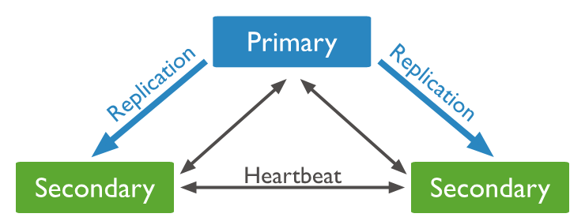
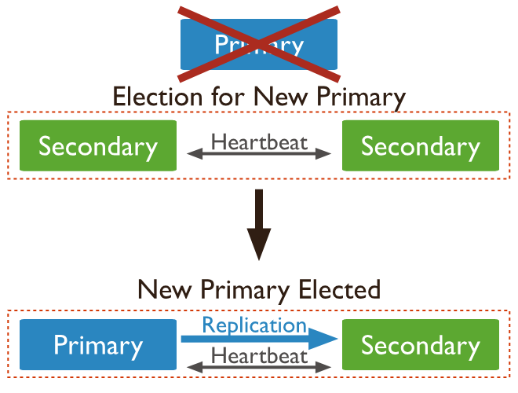
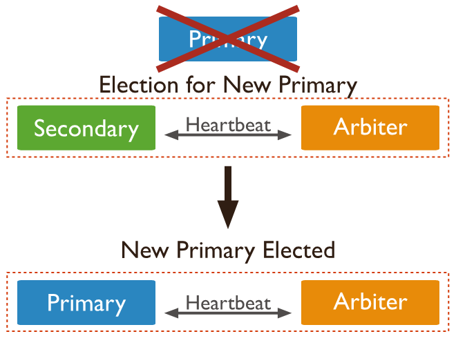
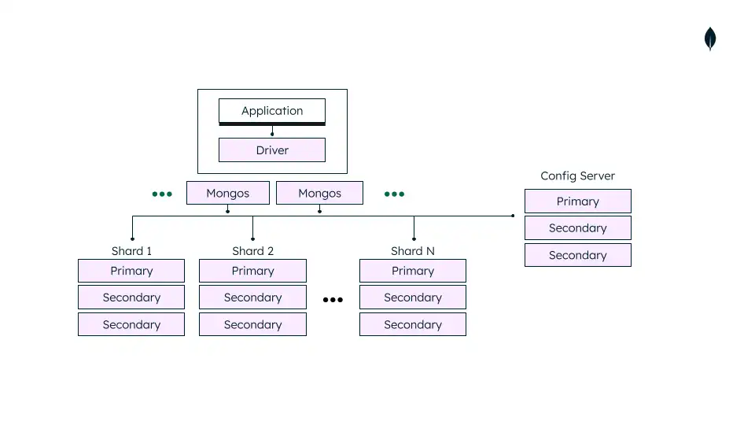

# mongodb

## 集群架构
- 副本集
- 分片

### 三节点副本集
副本集的最小推荐架构

要实现副本集的优势，副本集至少需要三个节点。三节点副本集可以具有三个数据承载节点（主节点-从节点-从节点）（推荐），如果情况（例如成本）禁止添加第三个数据承载节点，则可以是两个数据承载节点加一个仲裁节点（主节点-从节点-仲裁节点）

#### 主节点以及两个从节点 (P-S-S)
具有三个存储数据的节点的副本集包含：
- 一个主节点。
- 两个从节点。两个从节点都可以在选举中成为主节点

除了主节点以外，这些部署还始终提供两个完整的数据集副本。这些副本集提供额外的容错和高可用性。如果主节点不可用，副本集将选择一个从节点以作为主节点并继续正常运行。旧的主节点在可用时重新加入副本集。

#### 主节点、从节点和仲裁节点 (P-S-A)

具有两个存储数据的节点的三节点副本集包含：
- 一个主节点。
- 一个从节点成员。从节点可以在选举中成为主节点。
- 一个仲裁节点。仲裁节点仅在选举中投票。

由于仲裁节点不持有数据副本，因此这些部署仅提供一份完整的数据副本。仲裁节点需要的资源更少，但冗余和容错能力也更为有限。

不过，具有主节点、从节点和仲裁节点的部署可以确保在主节点或 从节点不可用时副本集仍然可用。如果主节点不可用，副本集将选择从节点以作为主节点。

> 参见文档: https://www.mongodb.com/zh-cn/docs/manual/core/replica-set-architecture-three-members/

### 分片集群
MongoDB 分片集群由以下组件构成：
- 分片：每个分片都包含分片数据的一个子集。每个分片都必须作为一个副本集进行部署。
- 使用 mongos 进行路由：mongos 充当查询路由器，在客户端应用程序和分片集群之间提供接口。
- 配置服务器：配置服务器会存储集群的元数据和配置设置。配置服务器必须部署为副本集 (CSRS)。

> 参见文档：https://www.mongodb.com/zh-cn/docs/manual/core/sharded-cluster-components/

## 监控告警

