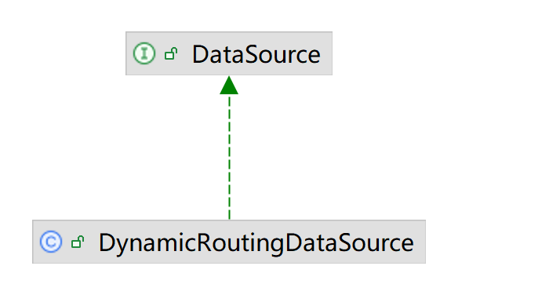

# mybatis-plus DataSource 源码解析
本文深入解读mybatis-plus的DataSource是如何整合hikari DataSource 和 p6spy DataSource

## 简介
javax.sql.DataSource是JDBC规范的一个核心接口，作为 DriverManager 机制的替代方案，用于管理数据库连接。
mybatis的SqlSessionFactory操作数据库就是基于DataSource的实现类，参见```org.apache.ibatis.mapping.Environment```

```java
public final class Environment {
   private final DataSource dataSource;
}
```

当你使用mybatis作为操作数据库的组件库，需要提供一个DataSource设置到SqlSessionFactory。
如果选择了hikari线程池，实际上就是将hikari的DataSource实现设置到mybatis的SqlSessionFactory

```java
@Bean
public SqlSessionFactoryBean sqlSessionFactory(DataSource dataSource) throws IOException {
    HikariConfig config = new HikariConfig();
    DataSource dataSource = HikariDataSource(config);
    SqlSessionFactoryBean sessionFactory = new SqlSessionFactoryBean();
    sessionFactory.setDataSource(dataSource);
    return sessionFactory;
}
```

现实的业务场景可能需要连接多个数据库，一个现成的解决方案就是引入mybatis-plus的多数据源组件。

mybatis-plus的多数据源DynamicRoutingDataSource也是DataSource的实现，并且集成了各种线程池和p6spy日志功能。
其原理如图所示：


mybatis-plus的DynamicRoutingDataSource，hikari的HikariDataSource，p6spy的P6DataSource如同俄罗斯套娃，通过
DataSource嵌套的方式，实现了多数据源切换，线程池，日志的功能。


## 创建DataSource

抽象接口的链路设计：

```text
DataSource --> DynamicDataSourceProvider -->DataSourceCreator
```

### DynamicRoutingDataSource
DynamicRoutingDataSource是mybatis-plus的DataSource接口实现



自动装配DynamicDataSourceAutoConfiguration将DynamicRoutingDataSource类注册为DataSource接口类型的Bean到Spring容器
```java
public class DynamicDataSourceAutoConfiguration implements InitializingBean {
    @Bean
    @ConditionalOnMissingBean
    public DataSource dataSource() {
        DynamicRoutingDataSource dataSource = new DynamicRoutingDataSource();
        //省略...
        return dataSource;
    }
}
```
DynamicRoutingDataSource本身不实现数据库操作，而是通过引入其他DataSource实现。

DynamicRoutingDataSource内部方法afterPropertiesSet调用了DynamicDataSourceProvider的loadDataSources方法加载不同的DataSource实现，

```java
@Slf4j
public class DynamicRoutingDataSource extends AbstractRoutingDataSource implements InitializingBean, DisposableBean {
    @Autowired
    private List<DynamicDataSourceProvider> providers;
    /**
     * 所有数据库
     */
    private final Map<String, DataSource> dataSourceMap = new ConcurrentHashMap<>();

    @Override
    public void afterPropertiesSet() throws Exception {
        // 添加并分组数据源
        Map<String, DataSource> dataSources = new HashMap<>(16);
        for (DynamicDataSourceProvider provider : providers) {
            dataSources.putAll(provider.loadDataSources());
        }
        for (Map.Entry<String, DataSource> dsItem : dataSources.entrySet()) {
            addDataSource(dsItem.getKey(), dsItem.getValue());
        }
    }
}
```


### DynamicDataSourceProvider


- 自动装配将YmlDynamicDataSourceProvider类注册为DynamicDataSourceProvider接口类型的Bean到Spring容器
- YmlDynamicDataSourceProvider通过其父类AbstractDataSourceProvider的createDataSourceMap方法调用到DefaultDataSourceCreator接口的createDataSource方法创建数据源

```java
public class DynamicDataSourceAutoConfiguration implements InitializingBean {
    @Bean
    public DynamicDataSourceProvider ymlDynamicDataSourceProvider() {
        return new YmlDynamicDataSourceProvider(properties.getDatasource());
    }
}

public class YmlDynamicDataSourceProvider extends AbstractDataSourceProvider {
    @Override
    public Map<String, DataSource> loadDataSources() {
        return createDataSourceMap(dataSourcePropertiesMap);
    }
}

@Slf4j
public abstract class AbstractDataSourceProvider implements DynamicDataSourceProvider {
    @Autowired
    private DefaultDataSourceCreator defaultDataSourceCreator;

    protected Map<String, DataSource> createDataSourceMap(
            Map<String, DataSourceProperty> dataSourcePropertiesMap) {
        Map<String, DataSource> dataSourceMap = new HashMap<>(dataSourcePropertiesMap.size() * 2);
        for (Map.Entry<String, DataSourceProperty> item : dataSourcePropertiesMap.entrySet()) {
            String dsName = item.getKey();
            DataSourceProperty dataSourceProperty = item.getValue();
            String poolName = dataSourceProperty.getPoolName();
            if (poolName == null || "".equals(poolName)) {
                poolName = dsName;
            }
            dataSourceProperty.setPoolName(poolName);
            dataSourceMap.put(dsName, defaultDataSourceCreator.createDataSource(dataSourceProperty));
        }
        return dataSourceMap;
    }
}
```

### DataSourceCreator


- 自动装配将HikariDataSourceCreator类注册为DataSourceCreator接口类型的Bean到Spring容器
- 多个注册的DataSourceCreator，List<DataSourceCreator>又被设置到DefaultDataSourceCreator类的属性
- DefaultDataSourceCreator的createDataSource方法循环调用DataSourceCreator接口实现类的createDataSource方法
- DataSourceCreator接口实现类的createDataSource方法会先调用其父类AbstractDataSourceCreator的createDataSource方法
- AbstractDataSourceCreator的createDataSource方法调用的wrapDataSource方法实现了p6spay数据源的包裹

```java
public class DynamicDataSourceCreatorAutoConfiguration {
    @ConditionalOnClass(HikariDataSource.class)
    @Configuration
    static class HikariDataSourceCreatorConfiguration {
        @Bean
        @Order(HIKARI_ORDER)
        public HikariDataSourceCreator hikariDataSourceCreator() {
            return new HikariDataSourceCreator();
        }
    }

    @Primary
    @Bean
    @ConditionalOnMissingBean
    public DefaultDataSourceCreator dataSourceCreator(List<DataSourceCreator> dataSourceCreators) {
        DefaultDataSourceCreator defaultDataSourceCreator = new DefaultDataSourceCreator();
        defaultDataSourceCreator.setCreators(dataSourceCreators);
        return defaultDataSourceCreator;
    }
}

public class DefaultDataSourceCreator {

    private List<DataSourceCreator> creators;

    public DataSource createDataSource(DataSourceProperty dataSourceProperty) {
        DataSourceCreator dataSourceCreator = null;
        for (DataSourceCreator creator : this.creators) {
            if (creator.support(dataSourceProperty)) {
                dataSourceCreator = creator;
                break;
            }
        }
        if (dataSourceCreator == null) {
            throw new IllegalStateException("creator must not be null,please check the DataSourceCreator");
        }
        return dataSourceCreator.createDataSource(dataSourceProperty);
    }

}

@Slf4j
public abstract class AbstractDataSourceCreator implements DataSourceCreator {
    @Override
    public DataSource createDataSource(DataSourceProperty dataSourceProperty) {
        DataSource dataSource = doCreateDataSource(dataSourceProperty);
        return wrapDataSource(dataSource, dataSourceProperty);
    }

    private DataSource wrapDataSource(DataSource dataSource, DataSourceProperty dataSourceProperty) {
        DataSource targetDataSource = dataSource;
        Boolean enabledP6spy = properties.getP6spy() && dataSourceProperty.getP6spy();
        if (enabledP6spy) {
            targetDataSource = new P6DataSource(dataSource);
        }
        return new ItemDataSource(name, dataSource, targetDataSource, enabledP6spy, enabledSeata, seataMode);
    }
}
```

### HikariDataSourceCreator
HikariDataSourceCreator负责创建HikariDataSource
```java
public class HikariDataSourceCreator extends AbstractDataSourceCreator implements DataSourceCreator, InitializingBean {
    @Override
    public DataSource doCreateDataSource(DataSourceProperty dataSourceProperty) {
        HikariConfig config = MERGE_CREATOR.create(gConfig, dataSourceProperty.getHikari());
        //省略。。。
        HikariDataSource dataSource = new HikariDataSource();
        //省略。。。
        return dataSource;
    }
}


```

### DriverDataSource
hikari的DriverDataSource类构造方法加载指定的JDBC实现作为操作数据库的驱动
```java
package com.zaxxer.hikari.util;

public final class DriverDataSource implements DataSource {
    public DriverDataSource(String jdbcUrl, String driverClassName, Properties properties, String username, String password)
    {
        driver = DriverManager.getDriver(jdbcUrl);
    }
}
```


## DataSource注入SqlSessionFactory

主要的调用链路如下

```text
SqlSessionTemplate --> SqlSessionFactory --> DynamicRoutingDataSource
```

- 自动装配注册了SqlSessionFactory类型的Bean，注入的DataSource就是DynamicRoutingDataSource
- 自动装配注册了SqlSessionTemplate类型的Bean，其方法注入了SqlSessionFactory
- 当调用sqlSessionTemplate执行SQL时，使用的数据源是DynamicRoutingDataSource，底层用就是HikariDataSource。
- 除了HikariDataSource，DynamicDataSourceCreatorAutoConfiguration还可以注册DruidDataSource，BeeDataSource，BasicDataSource等等。

```java
public class MybatisPlusAutoConfiguration implements InitializingBean {
    @Bean
    @ConditionalOnMissingBean
    public SqlSessionFactory sqlSessionFactory(DataSource dataSource) throws Exception {
        MybatisSqlSessionFactoryBean factory = new MybatisSqlSessionFactoryBean();
        factory.setDataSource(dataSource);
        // 省略
        return factory.getObject();
    }

    @Bean
    @ConditionalOnMissingBean
    public SqlSessionTemplate sqlSessionTemplate(SqlSessionFactory sqlSessionFactory) {
        ExecutorType executorType = this.properties.getExecutorType();
        return executorType != null ? new SqlSessionTemplate(sqlSessionFactory, executorType) : new SqlSessionTemplate(sqlSessionFactory);
    }
}
```

