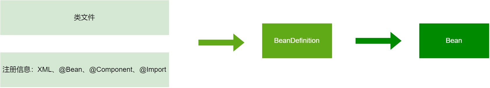
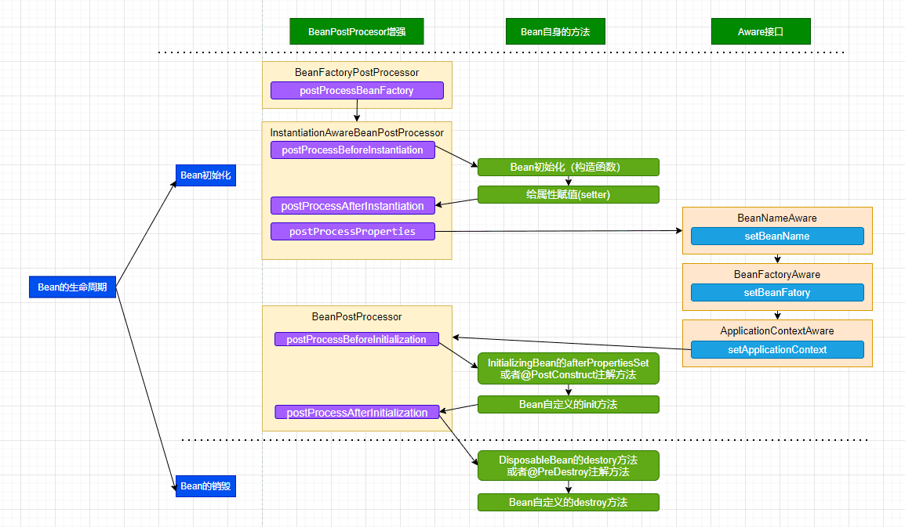

## Bean的生命周期
广义的Bean的生命周期包含三个部分：MultiDefinition，BeanDefinition，Bean。两个步骤：注册BeanDefinition，注册Bean


#### MultiDefinition
Bean本质是一个实例化的对象，要实例化出一个对象，首先要有模板，这个模板就是类或者接口。
其次要有如何实例化的描述信息，这种描述信息主要是以xml形式或者注解形式生成。


#### BeanDefinition
BeanDefinition是标准化后的Bean如何实例化的描述信息，由于初始的实例化的描述信息的形式多样，需要一个标准化的中间产物，方便后续处理

#### Bean
Bean就是根据BeanDefinition使用反射的方式实例化的对象




## MultiDefinition

#### xml方式

```xml
<bean id="myBean" 
      class="com.example.MyClass" 
      scope="singleton" 
      factory-method="createInstance" 
      factory-bean="myFactoryBean" 
      init-method="init" 
      destroy-method="cleanup" 
      autowire="byType" 
      dependency-check="all" 
      lazy-init="true" 
      primary="true" 
      abstract="false" 
      abstract="true">
    
    <property name="propertyName" value="propertyValue"/>
    <property name="anotherProperty" ref="anotherBean"/>
    
    <constructor-arg index="0" value="constructorValue"/>
    <constructor-arg index="1" ref="anotherBean"/>
    
    <qualifier value="specificBean"/>
    <lookup-method method="getBean" bean="myBean"/>
</bean>
```
属性说明
* id: Bean 的唯一标识符。
* class: Bean 的全限定类名。
* scope: Bean 的作用域，常见值包括 singleton（单例）、prototype（原型）。
* factory-method: 指定一个静态工厂方法用于创建 Bean。
* factory-bean: 指定工厂 Bean 的 ID。
* init-method: 指定初始化方法。
* destroy-method: 指定销毁方法。
* autowire: 自动装配方式，常见值包括 byType、byName、constructor，或 no。
* dependency-check: 指定依赖检查的级别，可以是 none、all、simple。
* lazy-init: 是否延迟初始化，true 表示延迟，false 表示立即初始化。
* primary: 是否为主要 Bean，true 表示是。
* abstract: 如果设置为 true，则该 Bean 不能被实例化，只能作为其他 Bean 的基类。

子标签
* <property>: 用于设置 Bean 的属性。
* <constructor-arg>: 用于设置构造函数参数。
* <qualifier>: 用于指定具体的 Bean 名称，通常与 @Autowired 一起使用。
* <lookup-method>: 定义一个查找方法，Spring 会在运行时为该方法返回一个 Bean。


#### 注解方式

```java
import org.springframework.beans.factory.annotation.Autowired;
import org.springframework.context.annotation.Bean;
import org.springframework.context.annotation.Configuration;
import org.springframework.context.annotation.Primary;
import org.springframework.context.annotation.Scope;

@Configuration
public class AppConfig {

  @Bean
  @Primary
  @Scope
  public MyClass myBean() {
    MyClass myClass = new MyClass();
    myClass.setPropertyName("propertyValue");
    return myClass;
  }
}
```
@Bean注解的属性
```java

@Target({ElementType.METHOD, ElementType.ANNOTATION_TYPE})
@Retention(RetentionPolicy.RUNTIME)
@Documented
public @interface Bean {
	@AliasFor("name")
	String[] value() default {};
    
	@AliasFor("value")
	String[] name() default {};

	@Deprecated
	Autowire autowire() default Autowire.NO;

	boolean autowireCandidate() default true;
    
	String initMethod() default "";
    
	String destroyMethod() default AbstractBeanDefinition.INFER_METHOD;
}

```
属性说明
* value：等同于下面的name属性
* name：相当于bean的id
* autowire：标志是否是一个引用的 Bean 对象
* autowireCandidate：是否作为其他对象注入时候的候选Bean
* initMethod：自定义初始化方法
* destroyMethod：自定义销毁方法

注解的方式包括如下

- @Component注解(@Repository, @Service, @Controller, @Configuration) + @ComponentScan
- @Import注解，@ImportSource注解，ImportSelect接口

## BeanDefinition
BeanDefinition是一个接口，实际上可能有多种BeanDefinition类：
- RootBeanDefinition
   - AbstractBeanDefinition
      - BeanMetadataAttributeAccessor
      - BeanDefinition
         - AttributeAccessor
         - BeanMetadataElement
- AnnotatedGenericBeanDefinition
   - GenericBeanDefinition
      - AbstractBeanDefinition
   - AnnotatedBeanDefinition
      - BeanDefinition
- ChildBeanDefinition
   - AbstractBeanDefinition
- ScannedGenericBeanDefinition
   - GenericBeanDefinition
   - AnnotatedBeanDefinition


注解类型的类和接口是通过执行BeanDefinitionRegistryPostProcessor接口的postProcessBeanDefinitionRegistry方法注册
的，核心实现类如下

- ConfigurationClassPostProcessor
- ConfigurationClass
- ConfigurationClassBeanDefinitionReader


执行顺序上，
1. 扫描启动对象sprivalApplication的基础目录下所有@Component注解的类，转化为ConfigurationClass对象
2. 处理@Import和ImportSelector接口的类，转化为ConfigurationClass对象
3. 处理ConfigurationClass注册BeanDefinition

执行过程中有递归法，会扫描出100多个ConfigurationClass对象


## Bean


https://www.processon.com/view/617febcbe0b34d1a7ea5405b


三级缓存：
一级缓存（singletonObjects）
二级缓存（singletonFactories）
三级缓存（earlySingletonObjects）
