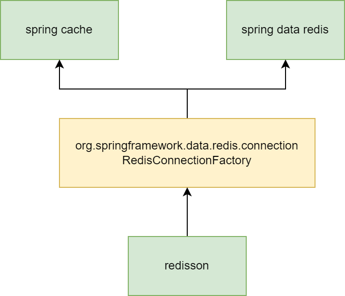

# redis

## 组件
- spring cache
- spring data redis 
- redisson

spring cache 是声明式缓存，使用多种缓存驱动，包括本地内存缓存和redis缓存，使用redis驱动时，操作redis取决于
org.springframework.data.redis.connection.RedisConnectionFactory的接口实现

spring data redis 是操作redis的集成客户端，底层可以选择使用jedis或lettuce

redisson 是比较全面的redis客户端操作，引入redisson的时候，其自动装配类会优先注册基于redisson client 的 RedisConnectionFactory。也就意味着
spring cache 和 spring data redis用的都是redisson client操作redis

## redisson

### 配置说明
TODO

### 监控预警
TODO
